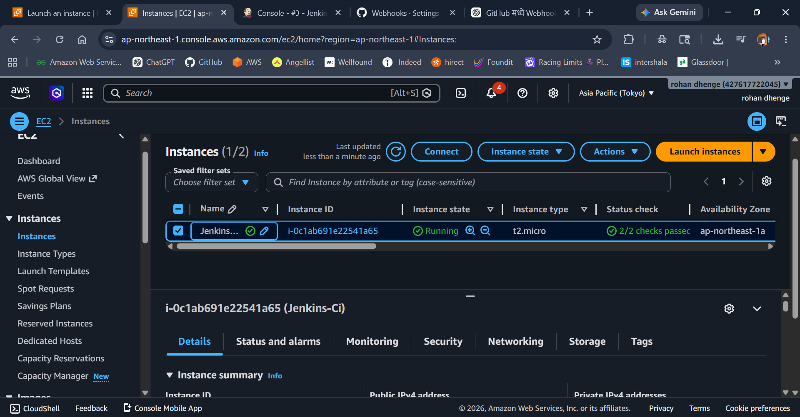

# 🚀 Jenkins + GitHub CI Pipeline Project

A beginner-friendly DevOps project that demonstrates Continuous Integration (CI) using Jenkins and GitHub.

---

# 📌 Project Overview

This project automates the software build process using:

- Jenkins
- GitHub
- Node.js
- Git
- Ubuntu EC2 Instance

Whenever code is pushed to GitHub, Jenkins automatically triggers a build pipeline.


---

# 🏗 Architecture

```text
Developer → GitHub → Jenkins Pipeline → Build/Test
```

---

# 🛠 Technologies Used

| Tool | Purpose |
|------|----------|
| Jenkins | Automation Server |
| GitHub | Source Code Hosting |
| Git | Version Control |
| Node.js | Sample Application |
| AWS EC2 | Hosting Jenkins |

---

# 📂 Project Structure

```text
myapp/
│
├── app.js
├── Jenkinsfile
└── README.md
```

---

# ☁️ Step 1 — Launch AWS EC2 Instance

Launch Ubuntu EC2 instance with:

- Ubuntu 22.04
- t2.micro
- 20 GB Storage

Open these ports in Security Group:

| Port | Purpose |
|------|----------|
| 22 | SSH |
| 8080 | Jenkins |

---



# 🔐 Step 2 — Connect to EC2

```bash
 ssh -i .\Downloads\pipeline.pem ubuntu@13.231.128.81
```

---

# ⚙️ Step 3 — Install Java

```bash
sudo apt update

sudo apt install openjdk-17-jdk -y
```

Check Java version:

```bash
java -version
```

---

# ⚙️ Step 4 — Install Jenkins

```bash
curl -fsSL https://pkg.jenkins.io/debian-stable/jenkins.io-2023.key | sudo tee \
/usr/share/keyrings/jenkins-keyring.asc > /dev/null

echo deb [signed-by=/usr/share/keyrings/jenkins-keyring.asc] \
https://pkg.jenkins.io/debian-stable binary/ | sudo tee \
/etc/apt/sources.list.d/jenkins.list > /dev/null

sudo apt update

sudo apt install jenkins -y
```

---

# ▶️ Step 5 — Start Jenkins

```bash
sudo systemctl start jenkins

sudo systemctl enable jenkins
```

Check Jenkins status:

```bash
sudo systemctl status jenkins
```


---

# 🌐 Step 6 — Access Jenkins

Open browser:

```text
http://YOUR_PUBLIC_IP:8080
```

---

# 🔑 Step 7 — Get Jenkins Admin Password

```bash
sudo cat /var/lib/jenkins/secrets/initialAdminPassword
```

Copy password and paste into Jenkins setup page.


---

# 📦 Step 8 — Install Git

```bash
sudo apt install git -y
```

Check Git:

```bash
git --version
```

---

# ⚙️ Step 9 — Install Node.js

```bash
sudo apt install nodejs npm -y
```

Check versions:

```bash
node -v

npm -v
```

---

# 📁 Step 10 — Create Node.js App

```bash
mkdir myapp

cd myapp
```

Create application file:

```bash
nano app.js
```

Paste:

```javascript
console.log("Hello from Jenkins CI Pipeline");
```

Save file.

---

# 🔄 Step 11 — Initialize Git Repository

```bash
git init
```

---

# 🌐 Step 12 — Create GitHub Repository

Create a new repository on GitHub:

```text
jenkins-ci-pipeline
```

---

# 📤 Step 13 — Push Code to GitHub

```bash
git add .

git commit -m "Initial Commit"

git branch -M main

git remote add origin https://github.com/rohandhenge/jenkins-ci-pipeline.git

git push -u origin main
```

Example:

```bash
git remote add origin https://github.com/rohandhenge/jenkins-ci-pipeline.git
```

---

# 📄 Step 14 — Create Jenkinsfile

```bash
nano Jenkinsfile
```

Paste:

```groovy
pipeline {
    agent any

    stages {

        stage('Clone') {
            steps {
                echo 'Cloning Source Code'
            }
        }

        stage('Build') {
            steps {
                echo 'Building Application'

                sh 'node app.js'
            }
        }

        stage('Test') {
            steps {
                echo 'Testing Application'
            }
        }

    }
}
```

Save file.

---

# 📤 Step 15 — Push Jenkinsfile

```bash
git add .

git commit -m "Added Jenkinsfile"

git push
```

---

# ⚙️ Step 16 — Create Jenkins Pipeline Job

Go to Jenkins Dashboard:

```text
New Item → Pipeline
```

Configure:

| Option | Value |
|--------|-------|
| SCM | Git |
| Repository URL | https://github.com/rohandhenge/jenkins-ci-pipeline.git |
| Branch | */main |

Under Pipeline:

```text
Pipeline script from SCM
```

Save project.

---

# ▶️ Step 17 — Run Pipeline

Click:

```text
Build Now
```


---

# 📜 Step 18 — Check Console Output

Go to:

```text
Build History → Console Output
```

Expected output:

```text
Hello from Jenkins CI Pipeline
```


---

# 🔥 Step 19 — Configure GitHub Webhook

In GitHub Repository:

```text
Settings → Webhooks → Add Webhook
```

Payload URL:

```text
https://github.com/rohandhenge/jenkins-ci-pipeline.git
```

Content Type:

```text
application/json
```

Select:

```text
Just the push event
```

Save webhook.

---

# ⚙️ Step 20 — Enable Jenkins Trigger

In Jenkins Pipeline Job:

```text
Configure → Build Triggers
```

Enable:

```text
GitHub hook trigger for GITScm polling
```

Save configuration.

---

# 🚀 Step 21 — Test Automatic Build

Edit app.js:

```javascript
console.log("Jenkins CI Pipeline Working after Webhook Integration");
```

Push changes:

```bash
git add .

git commit -m "Testing webhook"

git push
```

Jenkins will automatically start a new build.

---

# ✅ Output

- Automatic CI Pipeline
- GitHub Integration
- Jenkins Automation
- Successful Node.js Build


---

# 📚 What I Learned

- Jenkins Installation
- GitHub Integration
- CI/CD Concepts
- Jenkins Pipeline
- Webhooks
- Pipeline as Code

---
# 👨‍💻 Author

Rohan Dhenge